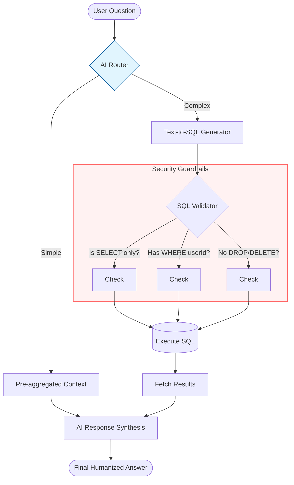

## Architectural Overview: Hybrid Query Routing & Execution

This architecture balances high-speed response times with deep-data flexibility by using an AI "Dispatcher" to route user queries through two distinct processing pipelines.

---
### Flow Diagram

---

### 1. The Decision & Dispatch Layer

The process begins when a **User Question** enters the system.

* **The AI Router:** A lightweight LLM call analyzes the intent. It acts as a traffic controller, determining if the answer lives in high-level summaries or requires a deep dive into the relational database.

---

### 2. The Processing Paths

#### **Path A: Simple (Pre-aggregated Context)**

* **Nature:** Fast and cost-effective.
* **Source:** Uses cached totals, daily summaries, or vector-stored metadata.
* **Best for:** "What is my total balance?" or "How many transactions did I have this month?"

#### **Path B: Complex (Text-to-SQL Generator)**

* **Nature:** Flexible and granular.
* **Mechanism:** The LLM translates natural language into a structured SQL query based on your database schema.
* **Best for:** "Show me all grocery expenses over $50 from last Tuesday."

---

### 3. The Security & Validation Guardrail

Before any generated SQL touches your database, it passes through a **Security Validator**. This is a non-negotiable step to prevent prompt injection or data corruption:

* **Read-Only Check:** Ensures the query starts with `SELECT`.
* **Scope Enforcement:** Checks for a mandatory `WHERE userId = {current_user}` clause.
* **Blacklist Filter:** Blocks destructive keywords like `DROP`, `DELETE`, or `UPDATE`.

---

### 4. Results & Synthesis

Once data is retrieved (from either path), it is sent to the **Final AI Formatter**.

* Instead of returning a raw database row or a JSON object, the AI synthesizes the data back into a natural, human-friendly sentence.
* **Example:** `{"count": 4}` becomes *"You had 4 successful transactions last week."*

---

## PROBLEMS ⚠️

1. Security — (biggest concern) AI could generate `DROP TABLE, DELETE,` or data-leaking queries across users if not sandboxed properly
You must run queries through a read-only DB user with strict permissions
Must enforce `WHERE userId = @userId` on every generated query — AI can forget this

2. Accuracy - AI can generate wrong SQL, especially for complex joins or edge cases
You need to validate the SQL before executing it

3. Performance - Every question hits the DB directly 
4. Cost - You need to send the full schema in every system prompt — that's a lot of tokens every single request